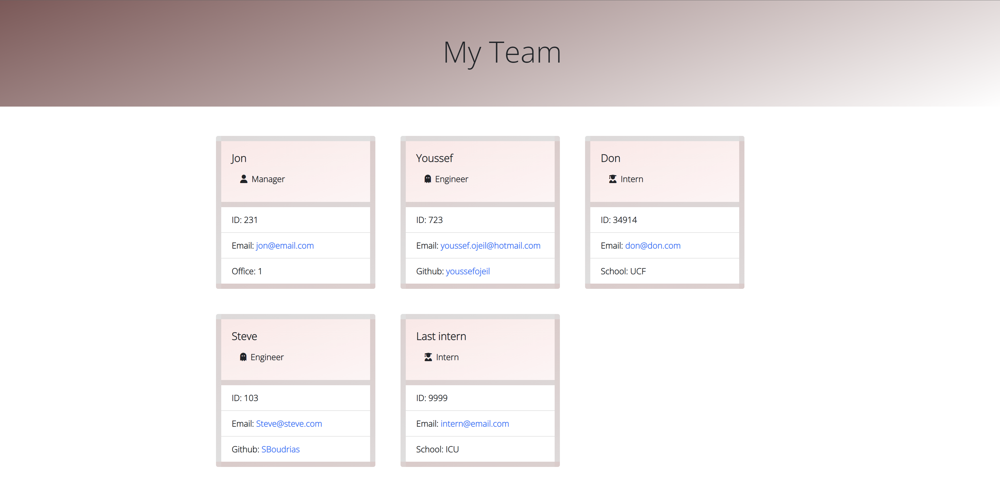

[](https://opensource.org/licenses/MIT)
# 10-Team-Profile-Generator
## Description
Node.js command-line application that takes in information about employees, then generates an HTML webpage that displays summaries for each person. 

## Table Of Contents
<li><a href="#installation">Installation</a></li>
<li><a href="#usage">Usage</a></li>
<li><a href="#demo">Demo</a></li>
<li><a href="#test">Test</a></li>
<li><a href="#license">License</a></li>
<li><a href="#questions">Questions</a></li>

## Installation
The modules used in this application are [Jest](https://www.npmjs.com/package/jest) for running the unit tests and [Inquirer](https://www.npmjs.com/package/inquirer/v/8.2.4) for collecting input from the user.

To install necessary dependencies, run the following command:
```sh
npm install
```

## Usage
Must have [Node.js](https://nodejs.org/en/) downloaded

Then run the following command: 
```sh 
node index.js
```

## Test
To test, run the following command:
```sh
npm run test
```

## Demo
[Video Demo](https://drive.google.com/file/d/106hDfU712bSyMqVc7IkyfXfyNnsWO9OU/view?usp=sharing)



## License
This project is licensed under the MIT https://opensource.org/licenses/MIT


## Questions
If you have any feedback please feel free to reach out at my github https://github.com/youssefojeil or by email at youssef.ojeil@hotmail.com.
